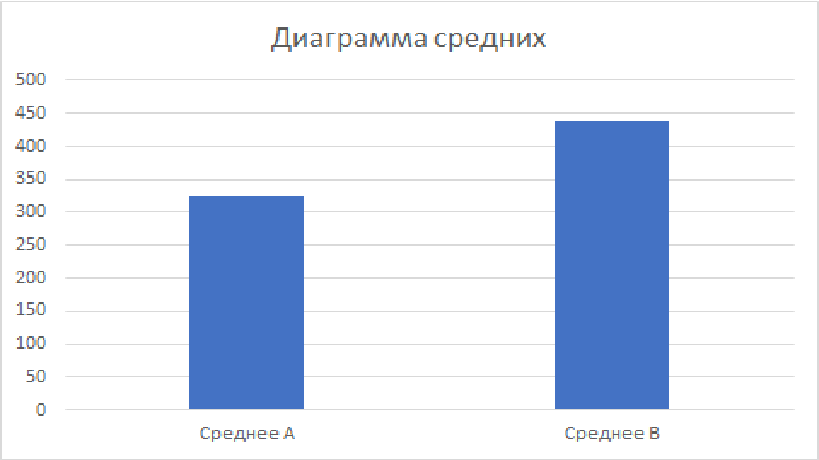

## Итоговый отчёт: тест нового онбординга

## Контекст
Тестировали новую версию онбординга (группа B) против текущей (группа A).
Задача — понять, увеличивает ли новая версия выручку с пользователя,
не ухудшая конверсию в покупку.

## Дизайн эксперимента
- Метрика успеха: средняя выручка на пользователя
- Guardrail-метрика: конверсия (доля купивших хоть раз)
- Размер выборки: 1000 пользователей в группе A, 1000 в группе B
- SRM-проверка: пройдена

## Обоснование размера выборки

Для обнаружения ожидаемого эффекта в конверсии (15% → 20%) при α=0.05
и мощности 80% теоретически требуется ~800 наблюдений на группу.
Фактический размер выборки (1000 на группу) превышает это значение,
что обеспечивает достаточную статистическую мощность.

## Гипотезы

**Revenue (Welch t-test):** H0: μ_A = μ_B, H1: μ_A ≠ μ_B
**Конверсия (z-тест для долей):** H0: p_A = p_B, H1: p_A ≠ p_B

## Результаты

Средняя выручка на пользователя выросла с 324.033₽ (группа A) до 436.375₽
(группа B) — рост на ~35% (p-value ≈ 0.005, значимо).

Конверсия выросла с 15.0% (группа A) до 20.0% (группа B) (p-value ≈ 0.003, значимо).

В обоих случаях p-value меньше выбранного уровня значимости α=0.05, 
поэтому обе нулевые гипотезы (H0) отвергаются — различие между 
группами статистически значимо, а не объясняется случайностью.

## Вывод
Группа B показала статистически значимый рост обеих метрик по сравнению
с группой A. Средняя выручка выросла на ~35% (абсолютно на 112,342 рубля), конверсия — на ~33% (абсолютно на 5 процентных
пунктов). Направление эффекта определено сравнением самих средних
значений (436.375₽ > 324.033₽, 20.0% > 15.0%) — в обоих случаях группа B выше,
то есть это улучшение, а не ухудшение.

## Рекомендация
Рекомендуется внедрить новую версию онбординга.

## Ограничения
- Данные синтетические (демонстрационный проект)
- Не учтён возможный novelty-эффект
- Не проводился анализ гетерогенности по сегментам пользователей
